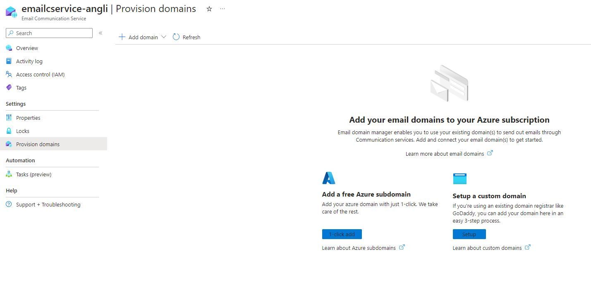

Installation
============

Prerequisites
-------------

SDK installation via pip
------------------------

To install azmailer using pip

.. code-block:: console

   (.venv) $ pip install azmailer

Configuration
=============

1. Create a new Azure Comunication Service (ACS)

.. image:: _static/comunication_services.jpg
   :alt: Create a new Azure Comunication Service
   :width: 100%

2. Create a new Email Comunication Service

3. create a sender/domain email on your email comunication Service

4. add the sender/domain to the email service

.. image:: _static/connect_the_domain.JPG
   :alt: Create a new Azure Comunication Service
   :width: 100%

5. take note of the connection string (on ACS) and the sender email (on email service)